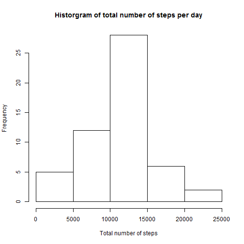
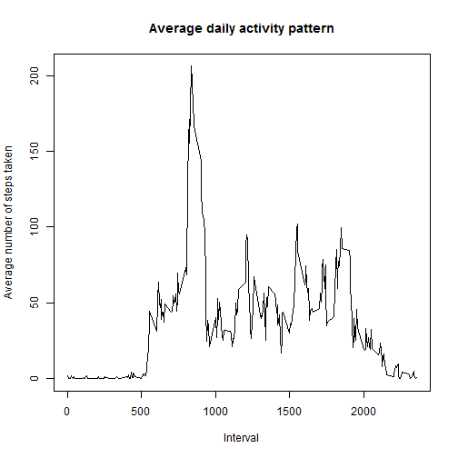
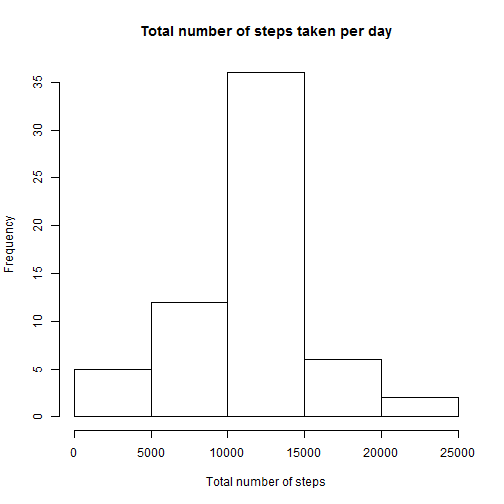

## Loading and preprocessing the data

```r
#Set working directory to where data is
setwd("C:/Users/Home/Desktop/Coursera/5. Reproducible Research/Peer Assessment 1/")

#Read data into R
data<-read.csv("activity.csv",header=TRUE,as.is=TRUE,na.strings="NA")

#Convert the date variable to date class
data$date<-as.Date(data$date, "%Y-%m-%d")
```

## What is mean total number of steps taken per day?
Total number of steps per day

```r
#total steps per day
total.steps<-tapply(data$steps,data$date,sum)
total.steps
```

```
## 2012-10-01 2012-10-02 2012-10-03 2012-10-04 2012-10-05 2012-10-06 
##         NA        126      11352      12116      13294      15420 
## 2012-10-07 2012-10-08 2012-10-09 2012-10-10 2012-10-11 2012-10-12 
##      11015         NA      12811       9900      10304      17382 
## 2012-10-13 2012-10-14 2012-10-15 2012-10-16 2012-10-17 2012-10-18 
##      12426      15098      10139      15084      13452      10056 
## 2012-10-19 2012-10-20 2012-10-21 2012-10-22 2012-10-23 2012-10-24 
##      11829      10395       8821      13460       8918       8355 
## 2012-10-25 2012-10-26 2012-10-27 2012-10-28 2012-10-29 2012-10-30 
##       2492       6778      10119      11458       5018       9819 
## 2012-10-31 2012-11-01 2012-11-02 2012-11-03 2012-11-04 2012-11-05 
##      15414         NA      10600      10571         NA      10439 
## 2012-11-06 2012-11-07 2012-11-08 2012-11-09 2012-11-10 2012-11-11 
##       8334      12883       3219         NA         NA      12608 
## 2012-11-12 2012-11-13 2012-11-14 2012-11-15 2012-11-16 2012-11-17 
##      10765       7336         NA         41       5441      14339 
## 2012-11-18 2012-11-19 2012-11-20 2012-11-21 2012-11-22 2012-11-23 
##      15110       8841       4472      12787      20427      21194 
## 2012-11-24 2012-11-25 2012-11-26 2012-11-27 2012-11-28 2012-11-29 
##      14478      11834      11162      13646      10183       7047 
## 2012-11-30 
##         NA
```

Histogram of the total number of steps taken per day

```r
#histogram of total number of steps per day
hist(total.steps, main="Historgram of total number of steps per day", xlab="Total number of steps", ylab="Frequency")
```

 

Mean total number of steps taken per day

```r
mean(total.steps,na.rm=TRUE)
```

```
## [1] 10766.19
```

Median total number of steps taken per day

```r
median(total.steps,na.rm=TRUE)
```

```
## [1] 10765
```

## What is the average daily activity pattern?

```r
###Calculate average steps taken in the various intervals
average.daily<-tapply(data$steps,data$interval,mean,na.rm=TRUE)

###Create a dataframe of the average daily pattern
average.daily.data<-data.frame(average.daily)
average.daily.data$interval<-rownames(average.daily.data)
```

Time series plot showing average daily activity pattern

```r
plot(average.daily.data$interval,average.daily.data$average.daily, type="l", main="Average daily activity pattern", xlab="Interval", ylab="Average number of steps taken")
```

 

5-minute interval with the maximum number of steps (on average across all days)

```r
average.daily.data[max(average.daily.data$average.daily),]$interval
```

```
## [1] "1705"
```

## Imputing missing values
Total number of rows in data with NA values

```r
sum(is.na(data$steps))
```

```
## [1] 2304
```

Strategy for imputing missing values: Mean of 5-minute interval will be used to impute missing values.
The rationale is that at different periods/intervals of the day, there are different activities going on. It would thus be more prudent to use the mean or median of the 5-minute interval to impute the missing values for that interval rather than use the mean or median for the entire day to impute missing values. In this case, I have chosen to use mean rather than median to impute the missing values.


```r
#Create a new data set with missing values imputed
unique.interval<-unique(data$interval)
data.impute<-numeric(0)
for(i in 1:length(unique.interval))
  {
    subset.data<-subset(data,data$interval==unique.interval[i])
    subset.interval<-subset(average.daily.data,average.daily.data$interval==unique.interval[i])
    subset.data$steps<-ifelse(is.na(subset.data$steps),subset.interval$average.daily,subset.data$steps)
    data.impute<-rbind(data.impute,subset.data)
  }
data.impute<-data.frame(data.impute)
data.impute<-data.impute[order(data.impute$date,data.impute$interval),]
```

Histogram of the total number of steps taken per day

```r
#Compute the total number of steps taken per day
total.impute<-tapply(data.impute$steps,data.impute$date,sum)

#Plot histogram
hist(total.impute,main="Total number of steps taken per day", xlab="Total number of steps", ylab="Frequency")
```

 

Mean of the total number of steps taken per day (using imputed data)

```r
mean(total.impute,na.rm=TRUE)
```

```
## [1] 10766.19
```

Median of the total number of steps taken per day (using imputed data)

```r
median(total.impute,na.rm=TRUE)
```

```
## [1] 10766.19
```

## Are there differences in activity patterns between weekdays and weekends?

```r
#Create factor variable indicating weekdays/weekends
data.impute$wkday<-weekdays(data.impute$date)
data.impute$type_of_day<-ifelse(data.impute$wkday=="Sunday" | data.impute$wkday=="Saturday","weekend","weekday")
data.impute$type_of_day<-as.factor(data.impute$type_of_day)
```


```r
#Calculate the average number of steps taken over all weekdays and weekends
average.impute<-tapply(data.impute$steps,list(data.impute$interval,data.impute$type_of_day),mean,na.rm=TRUE)

###Create a dataframe of the average across weekdays and weekends
avg.impute<-data.frame(average.impute)
avg.impute$interval<-rownames(avg.impute)
type_of_day<-c(rep("weekday",length(avg.impute$interval)),rep("weekend",length(avg.impute$interval)))
type_of_day<-as.factor(type_of_day)
avg.impute.wkday<-avg.impute[,c(1,3)]
avg.impute.wkend<-avg.impute[,c(2,3)]
names(avg.impute.wkday)<-c("steps","interval")
names(avg.impute.wkend)<-c("steps","interval")
avg.impute.data<-rbind(avg.impute.wkday,avg.impute.wkend)
avg.impute.data<-cbind(avg.impute.data,type_of_day)
names(avg.impute.data)<-c("steps","interval","type_of_day")
```

Panel plot showing time series of the 5-minute interval and the average number of steps taken, averaged across all weekdays or weekends

```r
#Create panel-plot
library(lattice)
avg.impute.data$interval<-as.numeric(avg.impute.data$interval)
xyplot(steps~interval|type_of_day,type="l",layout=c(1,2),data=avg.impute.data,xlab="Interval",ylab="Number of steps")
```

 
